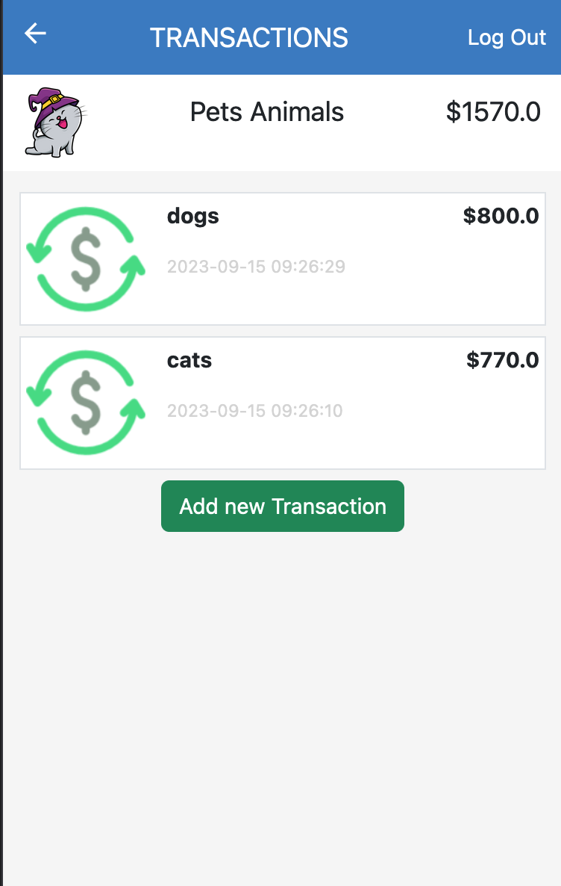

<a name="readme-top"></a>

<div align="center">
  
  <br/>
  <h3><b>My Budget App</b></h3>
</div>

<!-- TABLE OF CONTENTS -->

# 📗 Table of Contents

- [📖 About the Project](#about-project)
  - [🛠 Built With](#built-with)
    - [Tech Stack](#tech-stack)
    - [Key Features](#key-features)
  - [🚀 Live Demo](#live-demo)
- [💻 Getting Started](#getting-started)
  - [Setup](#setup)
  - [Prerequisites](#prerequisites)
  - [Install](#install)
  - [Usage](#usage)
  - [Run tests](#run-tests)
  - [Deployment](#triangular_flag_on_post-deployment)
- [👥 Authors](#authors)
- [🔭 Future Features](#future-features)
- [🤝 Contributing](#contributing)
- [⭐️ Show your support](#support)
- [🙏 Acknowledgements](#acknowledgements)
- [❓ FAQ (OPTIONAL)](#faq)
- [📝 License](#license)

<!-- PROJECT DESCRIPTION -->

# 📖 My Budget App <a name="about-project"></a>

**KS Budget** is about building a mobile web application where you can manage one's budget:  Showing a list of transactions associated with a category, so that one can see how much money he/she spent and on what.

## 🛠 Built With <a name="built-with"></a>

### Tech Stack <a name="tech-stack"></a>

- [ ] Postgres
- [ ] Rails
- [ ] Ruby

<details>
  <summary>Client</summary>
  <ul>
    <li><a href="https://www.w3schools.com/html/">HTML & Bootstrap</a></li>
  </ul>
</details>

<details>
  <summary>Server</summary>
  <ul>
    <li><a href="https://guides.rubyonrails.org/">Rails</a></li>
  </ul>
</details>

<details>
<summary>Database</summary>
  <ul>
    <li><a href="https://www.postgresql.org/">PostgreSQL</a></li>
  </ul>
</details>

<!-- Features -->

### Key Features <a name="key-features"></a>

- **Add category**
- **Add transaction**
- **Display expenses**

<p align="right">(<a href="#readme-top">back to top</a>)</p>

<!-- LIVE DEMO -->

## 🚀 Live Demo <a name="live-demo"></a>

> Here you can visit my live demo :

- [My Budget App](https://mohamed-budget-app.onrender.com/splash_screen)

> Here you can see my presentation :

- [My Budget App Video Presentation](https://www.loom.com/share/Loom-Recorder-Settings-15-September-2023-c2192e9883c541988fc274cc61b248f2)

<p align="right">(<a href="#readme-top">back to top</a>)</p>


<!-- GETTING STARTED -->

## 💻 Getting Started <a name="getting-started"></a>

To get a local copy up and running, follow these steps.

- [ ] Run `bundle i` to install the dependencies.
- [ ] Run `npm i` to install npm dependencies.
- [ ] Run `rails s` to run the application

### Prerequisites

In order to run this project you need:


```sh
 gem install rails
```

### Setup

Clone this repository to your desired folder:


```sh
  cd Recipe-Group-project
  git clone https://github.com/MMGGYY66/my-budget-app.git
```

### Install

Install this project with:

```sh
  cd RoR-Capstone-Project
  bundle install
```

### Usage

To run the project, execute the following command:

```sh
  rails server
```

### Run tests

To run tests, run the following command:


```sh
  rspec
```

<p align="right">(<a href="#readme-top">back to top</a>)</p>

<!-- AUTHORS -->

## 👥 Author <a name="authors"></a>

👤 **Mohamed Gamil Eldimardash**

- GitHub: [@github](https://github.com/MMGGYY66)
- LinkedIn: [LinkedIn](https://www.linkedin.com/in/mohamed-eldimardash-0023a3b5/)
- Twitter: [twitter](https://twitter.com/MOHAMEDELDIMARd)
- Facebook: [facebook](https://www.facebook.com/MOHAMED.ELDIMARDASH/)
- StackOverflow: [stackoverflow](https://stackoverflow.com/users/13605630/mohamed-gamil-eldimardash)

<!-- FUTURE FEATURES -->

## 🔭 Future Features <a name="future-features"></a>.

- [ ] **Menu**
- [ ] **Notifications**

<p align="right">(<a href="#readme-top">back to top</a>)</p>

<!-- CONTRIBUTING -->

## 🤝 Contributing <a name="contributing"></a>

Contributions, issues, and feature requests are welcome!

Feel free to check the [issues page](../../issues/).

<p align="right">(<a href="#readme-top">back to top</a>)</p>

<!-- SUPPORT -->

## ⭐️ Show your support <a name="support"></a>

If you like this project, like it.

<!-- ACKNOWLEDGEMENTS -->

## 🙏 Acknowledgments <a name="acknowledgements"></a>


** WE would like to thank to Microverse for giving this inspiring project**<br>

Here is the Original design idea by Gregoire Vella on Behance. 👉[Template](https://www.behance.net/gallery/19759151/Snapscan-iOs-design-and-branding?tracking_source=)

<p align="right">(<a href="#readme-top">back to top</a>)</p>

<!-- LICENSE -->

## 📝 License <a name="license"></a>

This project is [MIT](https://github.com/MMGGYY66/my-budget-app/blob/dev/LICENSE.md) licensed.

<p align="right">(<a href="#readme-top">back to top</a>)</p>
